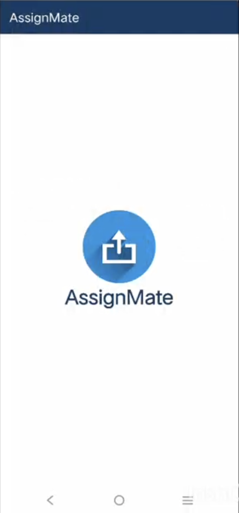
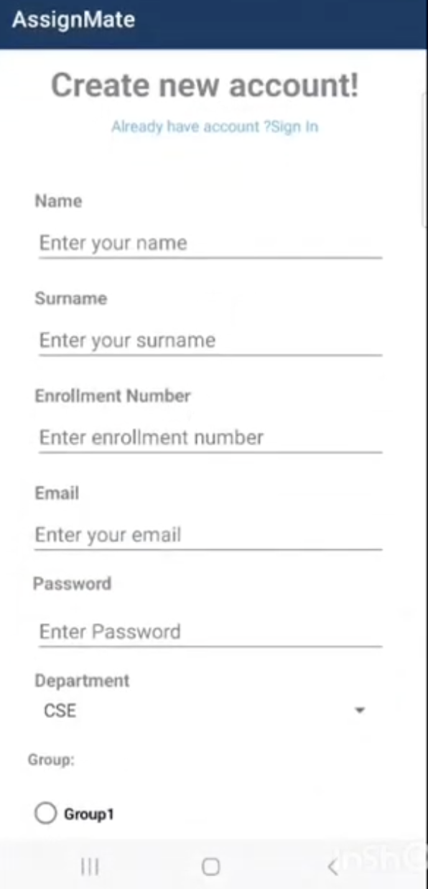
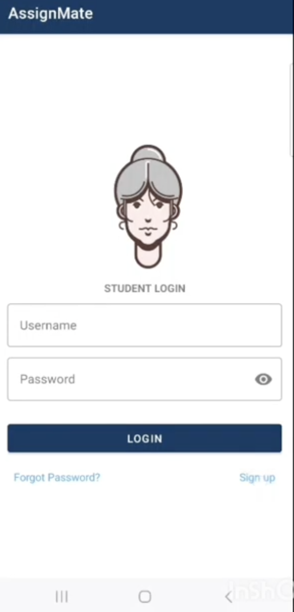
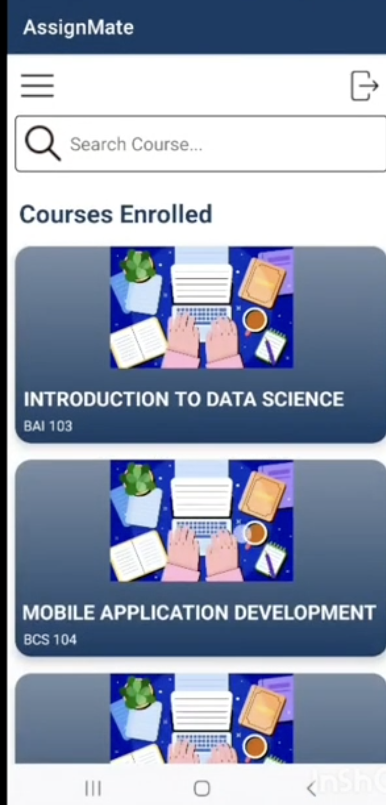
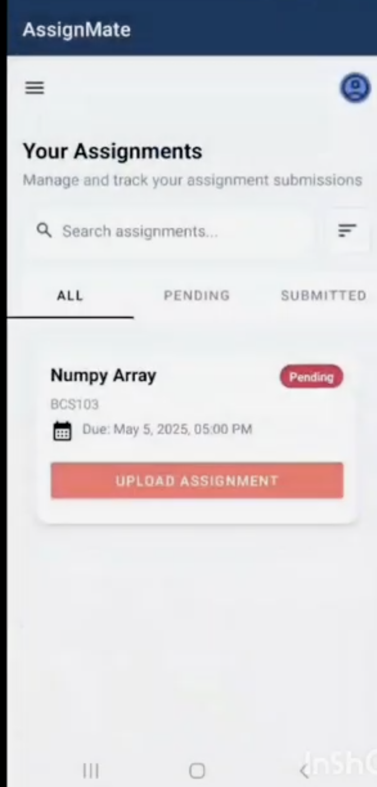
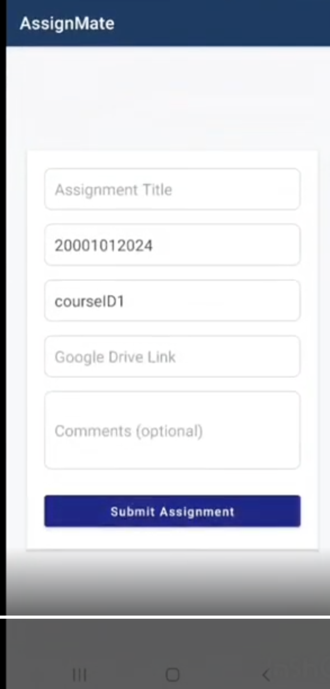

# 📚 AssignMate

> An intelligent Android application for students to manage courses, track assignment deadlines, and submit work seamlessly via the cloud.


## 📖 Table of Contents
- [About](#-about)
- [Key Features](#-key-features)
- [App Snippets](#-app-snippets)
- [Tech Stack](#-tech-stack)
- [Database Structure](#-database-structure)
- [Installation & Setup](#-installation--setup)
- [Contributing](#-contributing)
- [Contact](#-contact)

## 📱 About
**AssignMate** is a native Android application designed to bridge the gap between students and their academic deadlines. It provides a centralized dashboard where students can view their registered courses based on their unique Enrollment Number, track pending assignments, and submit their work directly using Google Drive links.

## ✨ Key Features

* **🔐 Secure Authentication:**
    * Real-time user registration and login powered by **Firebase Authentication**.
    * Links student profiles to unique Enrollment Numbers (`Eno`).

* **📂 Smart Course Management:**
    * Automatically fetches courses linked to the student's enrollment number.
    * Displays course codes and descriptions dynamically.

* **📝 Assignment Tracking:**
    * **Tabbed Interface:** Efficiently switch between assignment states:
        * **All:** Complete overview of workload.
        * **Pending:** Prioritize tasks that need attention.
        * **Submitted:** Archive of completed submissions.
    * **Status Updates:** Real-time tracking of assignment status (e.g., "Pending", "Submitted").

* **☁️ Cloud Submission:**
    * Submit assignments by simply pasting a **Google Drive link**.
    * Stores submission links (`filesUploaded`) directly in the database for easy retrieval.

## 📸 App Snippets

A walkthrough of the application user interface.

### **Onboarding Flow**
| Splash Screen | Create Account | Student Login |
|:---:|:---:|:---:|
|  |  |  |

### **Main Dashboard & Actions**
| Courses Enrolled | Assignment Tracker | Submit Task |
|:---:|:---:|:---:|
|  |  |  |

## 🛠 Tech Stack

* **Language:** Kotlin
* **Frontend:** Android XML, Material Design, ViewPager (Tab Layout)
* **Architecture:** MVVM / MVC (Activity & Fragment based)
* **Backend:** Firebase
    * **Auth:** Email/Password Login
    * **Realtime Database:** JSON-based NoSQL storage for Students, Courses, and Assignments.

## 🗄 Database Structure
To run this app correctly, your Firebase Realtime Database should adhere to the following schema structure, matching the project's data classes:

### 1. Students Node
Stores user profile information.
```json
"Students": {
  "user_id": {
    "id": "String",
    "email": "String",
    "Eno": "String (Enrollment Number)",
    "Fname": "String (First Name)",
    "Sname": "String (Surname)"
  }
}
```

### 2. Courses Node
Stores available subjects.
```json
"Courses": {
  "course_id": {
    "id": "String",
    "name": "String",
    "description": "String"
  }
}
```

### 3. Assignments Node
Tracks individual tasks.
```json
"Assignments": {
  "assignment_id": {
    "title": "String",
    "course": "String",
    "courseCode": "String",
    "dueDate": "String",
    "status": "String (e.g., 'Pending', 'Submitted')",
    "filesUploaded": "String (Google Drive Link)"
  }
}
```

### 4. Enrollments Node
Maps students to courses via Enrollment Number.
```json
"Enrollments": {
  "enrollment_id": {
    "id": "String",
    "enrollmentNumber": "String (Matches Student.Eno)",
    "courseId": "String (Matches Course.id)"
  }
}
```

## 🚀 Installation & Setup

To run this project locally, you need **Android Studio** and a valid **Firebase Project**.

### 1. 📥 Clone the Repository
```bash
git clone [https://github.com/shuchish06/ASSIGNMATE.git](https://github.com/shuchish06/ASSIGNMATE.git)
```

### 2. 📱 Open in Android Studio
1.  Open Android Studio.
2.  Click **File** → **Open**.
3.  Select the `ASSIGNMATE` folder.
4.  Allow Gradle to sync dependencies.

### 3. 🔥 Firebase Configuration (Critical)
1.  Go to the [Firebase Console](https://console.firebase.google.com/).
2.  Create a new Firebase project.
3.  Add an Android app with the package name:
    `com.robox.galaxy`
    *(Confirm this in your `AndroidManifest.xml`)*.
4.  Download the `google-services.json` file.
5.  Place it inside the `app/` directory of the project.

### 4. 🔐 Enable Firebase Services
In the Firebase Console:
* Enable **Authentication** (Sign-in method: Email / Password).
* Enable **Realtime Database** (Import the provided JSON structure if required).

### 5. ▶️ Run the App
1.  Connect an Android device or start an emulator.
2.  Click **Run ▶** in Android Studio.

## ✅ Requirements
* Android Studio (latest stable)
* Android SDK
* Firebase account
* Internet connection

## 🎥 Demo Video

[Click here to watch the demo video](https://drive.google.com/drive/folders/17EVn_iiMUATVERsirQBhDObVoVZnuB6c?usp=drive_link)


## 📞 Contact
**Shuchi** GitHub: [@shuchish06](https://github.com/shuchish06)
